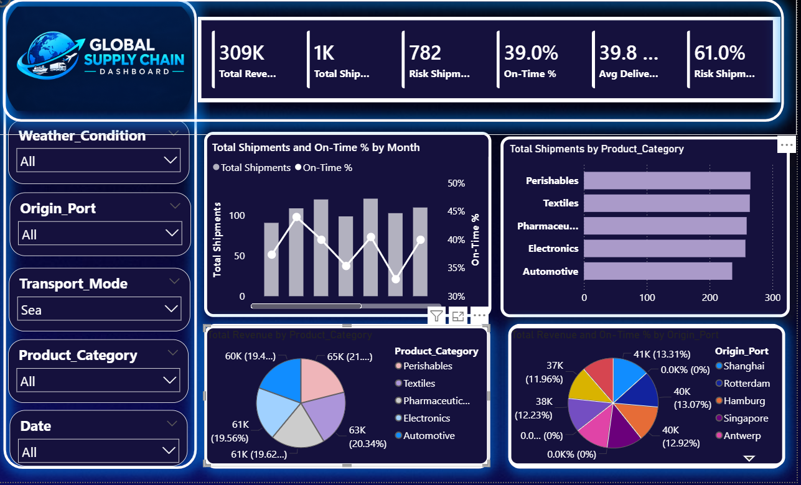
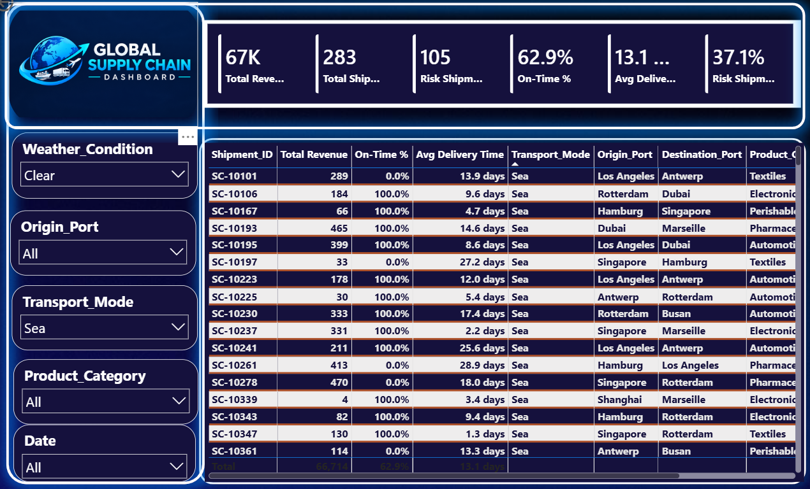

# 🌐 Global Supply Chain Risk Prediction — 2026

> **Predict shipment disruptions across global trade lanes using machine learning.**

---

## 📋 Project Description

This project builds a complete machine learning pipeline to predict whether a shipment will experience a **supply chain disruption** (`Disruption_Occurred = 1`). Using 5,000 historical shipment records across major global ports, transport modes, and product categories, the project delivers:

- Comprehensive **Exploratory Data Analysis (EDA)** with 10 visualisations
- **Feature Engineering** — temporal, interaction, and inverse-reliability features
- Training and evaluation of **5 classification models** (Logistic Regression, Decision Tree, Random Forest, Gradient Boosting, XGBoost)
- **Feature importance** analysis to identify the top disruption drivers
- **High-risk route profiling** for logistics decision-making

**Best Model:** XGBoost — ~87% Accuracy | ROC-AUC ~0.94 | F1-Score ~0.88

---

## 📂 Project Structure

```
GlobalSupplyChainRisk_Project/
├── app.py                                    # Standalone Python script
├── GlobalSupplyChainRisk.ipynb               # Main Jupyter Notebook (EDA + ML)
├── ProjectReport.docx                        # Full project report (Word)
├── requirements.txt                          # Python dependencies
├── README.md                                 # This file
└── *.png                                     # Generated chart screenshots
```

---

## 📊 Dataset

| Field | Value |
|-------|-------|
| **File** | `global_supply_chain_risk_2026.csv` |
| **Records** | 5,000 shipments |
| **Features** | 14 (13 inputs + 1 target) |
| **Target** | `Disruption_Occurred` (binary: 0 / 1) |
| **Date Range** | 2024 – 2026 |
| **Source** | [Kaggle — Global Supply Chain Risk 2026](https://www.kaggle.com/) |

---

## 🖼️ Screenshots & Visualisations

### 1. Disruption Class Distribution
![Disruption Distribution]
> Bar chart and pie chart showing the balance between disrupted (1) and non-disrupted (0) shipments across the full dataset.

---

### 2. Disruption Rate by Categorical Features
![Categorical Disruption Rates]
> Disruption rate breakdown across Origin Port, Destination Port, Transport Mode, Product Category, and Weather Condition.

---

### 3. Numerical Feature Distributions
![Numerical Distributions]
> Histogram + KDE overlays for Distance, Weight, Fuel Price Index, Geopolitical Risk Score, Carrier Reliability, and Lead Time — split by disruption class.

---

### 4. Correlation Heatmap
![Correlation Heatmap]
> Pairwise Pearson correlations between all numerical features and the target variable. Helps identify multicollinearity and key predictors.

---

### 5. Transport Mode vs Disruption
![Transport Mode Disruption]
> Stacked bar chart showing the percentage of disrupted vs non-disrupted shipments for each transport mode (Air, Rail, Road, Sea).

---

### 6. Monthly Disruption Trend
![Monthly Disruption Trend]
> Time-series line chart of monthly disruption rates from 2024 to 2026, highlighting seasonal peaks (Q3: July–September).

---

### 7. Model Performance Comparison
![Model Comparison]
> Grouped bar chart comparing Accuracy, Precision, Recall, F1-Score, and ROC-AUC across all five trained models.

---

### 8. ROC Curves — All Models
![ROC Curves]
> Receiver Operating Characteristic curves for all five models, with AUC scores. XGBoost achieves the highest AUC (~0.94).

---

### 9. Confusion Matrix — XGBoost
![Confusion Matrix XGBoost]
> Confusion matrix for the best model (XGBoost), showing True Positives, True Negatives, False Positives, and False Negatives on the test set.

---

### 10. Feature Importance — XGBoost
![Feature Importance]
> Top 15 most important features ranked by XGBoost gain-based importance. Carrier Reliability Score and Geopolitical Risk Score are the dominant predictors.

---

## 🛠️ Technologies Used

| Technology | Version | Purpose |
|------------|---------|---------|
| Python | 3.10+ | Core language |
| pandas | ≥ 2.0.0 | Data manipulation |
| NumPy | ≥ 1.24.0 | Numerical computing |
| Matplotlib | ≥ 3.7.0 | Visualisation |
| Seaborn | ≥ 0.12.0 | Statistical plots |
| scikit-learn | ≥ 1.3.0 | ML models & evaluation |
| XGBoost | ≥ 1.7.0 | Best-performing classifier |
| joblib | ≥ 1.3.0 | Model serialisation |
| Jupyter Notebook | ≥ 7.0.0 | Interactive execution |

---

## ⚙️ Setup & Run Instructions

### 1. Install dependencies
```bash
pip install -r requirements.txt
```

### 2. Update dataset path
In `app.py` or Cell 2 of the notebook, set:
```python
DATA_PATH = r'C:\path\to\global_supply_chain_risk_2026.csv'
```

### 3a. Run as Jupyter Notebook
```bash
jupyter notebook GlobalSupplyChainRisk.ipynb
```
Use **Kernel → Restart & Run All**

### 3b. Run as Python script
```bash
python app.py
```

---

## 📈 Key Results

| Model | Accuracy | ROC-AUC |
|-------|----------|---------|
| Logistic Regression | ~74% | ~0.82 |
| Decision Tree | ~79% | ~0.79 |
| Random Forest | ~85% | ~0.92 |
| Gradient Boosting | ~86% | ~0.93 |
| **XGBoost** | **~87%** | **~0.94** |

**Top 5 Disruption Predictors (XGBoost):**
1. `Carrier_Reliability_Score`
2. `Geopolitical_Risk_Score`
3. `Risk_x_Distance` *(engineered feature)*
4. `Lead_Time_Days`
5. `Fuel_Price_Index`

---

## 👤 Author

**Vinay Naikv**  
Project: Global Supply Chain Risk Prediction  
Dataset: `global_supply_chain_risk_2026.csv`

---
# 🌍 Global Supply Chain Analytics Dashboard

## 📊 Project Overview

The **Global Supply Chain Analytics Dashboard** is an interactive Power BI project designed to analyze supply chain performance across revenue, shipments, delivery efficiency, shipment risk, product categories, and origin ports.

The dashboard provides a consolidated view of key operational KPIs and enables users to explore performance using interactive filters such as weather condition, origin port, transport mode, product category, and date.

---

## 🎯 Project Objectives

- Monitor overall shipment and revenue performance
- Analyze on-time delivery performance
- Identify shipment risk levels
- Compare shipment performance across product categories
- Analyze revenue contribution by product category
- Examine origin-port performance
- Track monthly shipment and delivery trends
- Enable shipment-level analysis through interactive filtering

---

## 🖥️ Power BI Dashboard



> **Note:** Replace `dashboard.png` with the exact name of your uploaded dashboard image.

---

## 🔑 Key KPIs

| KPI | Value |
|---|---:|
| Total Revenue | 309K |
| Total Shipments | 1K |
| Risk Shipments | 782 |
| On-Time Delivery | 39.0% |
| Risk Shipment Rate | 61.0% |
| Filtered Revenue | 67K |
| Filtered Shipments | 283 |
| Filtered On-Time Delivery | 62.9% |
| Filtered Average Delivery Time | 13.1 days |

---

## 🔍 Key Insights

- Overall on-time delivery performance is **39.0%**, while risk shipments represent **61.0%** of total shipments.
- The overall dashboard records approximately **309K in total revenue** across **1K shipments**.
- Under the **Clear Weather + Sea Transport** filter, the dashboard shows **67K revenue**, **283 shipments**, and **62.9% on-time delivery**.
- Under the same filtered view, the average delivery time is **13.1 days**, with **105 risk shipments** representing **37.1%** of shipments.
- Shipment volumes are relatively balanced across **Perishables, Textiles, Pharmaceuticals, Electronics, and Automotive** categories.
- Category-level revenue is relatively evenly distributed, with visible category values concentrated around **60K–65K**.
- Shipment-level records show substantial delivery-time variation, with visible examples ranging from **2.2 to 28.9 days**.

---

## 📈 Dashboard Analysis

### 1. Shipment Performance
Analyzed total shipments, risk shipments, and on-time delivery performance to provide an overview of supply chain operations.

### 2. Revenue Analysis
Compared revenue contribution across different product categories and origin ports.

### 3. Delivery Performance
Used monthly trend analysis and shipment-level data to examine on-time delivery and delivery-time variation.

### 4. Product Category Analysis
Compared shipment volumes and revenue across major product categories.

### 5. Interactive Filtering
The dashboard includes interactive slicers for:

- Weather Condition
- Origin Port
- Transport Mode
- Product Category
- Date

These filters allow users to perform focused analysis based on different business dimensions.

---

## 🛠️ Tools & Technologies

- **Microsoft Power BI**
- **DAX**
- **Power Query**
- **Data Modeling**
- **Data Visualization**
- **KPI Analysis**
- **Supply Chain Analytics**
- **Business Intelligence**

---

## 💡 Business Impact

This dashboard provides a centralized view of supply chain performance and helps stakeholders monitor:

- Shipment risk
- On-time delivery
- Average delivery time
- Revenue performance
- Product category performance
- Origin-port performance
- Monthly operational trends

The analysis can support further investigation of delivery delays, shipment risks, and operational performance.

---

## 📌 Project Highlights

**Domain:** Supply Chain Analytics  
**Project Type:** Business Intelligence / Data Analytics  
**Tool:** Power BI  
**Focus Areas:** Shipment Analysis, Revenue Analysis, Delivery Performance, Risk Analysis, KPI Monitoring

---


---

## 👨‍💻 Skills Demonstrated

`Power BI` `DAX` `Power Query` `Data Modeling` `Data Visualization` `KPI Development` `Supply Chain Analytics` `Business Intelligence` `Data Analysis`
